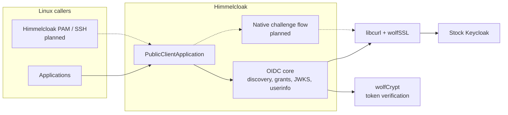

# himmelcloak

himmelcloak is a standalone Rust library for native authentication against
self-hosted Keycloak. Linux applications can use it directly. It does not
depend on another Linux login provider or require a Keycloak server plugin.
Himmelcloak's own PAM and SSH login integration is planned, not yet implemented.
The library first uses Keycloak's standard OIDC APIs where they cover a login.
A typed, resumable flow driver is the intended path for factors that Keycloak
normally presents through its browser login pages.

The current implementation covers discovery, password direct grant, ID-token
verification, refresh, revocation, and userinfo. The native flow driver,
WebAuthn, and recovery codes are still in development.
HTTPS uses wolfSSL through libcurl, and cryptographic operations use the
official `wolfssl-wolfcrypt` Rust crate.

## Architecture



See [Architecture](docs/Architecture.md) for the current implementation and
planned native login flow.

## Quick start

Docker with Compose v2 provides the reproducible build and a real Keycloak login test:

```sh
git clone https://github.com/aidangarske/himmelcloak.git
cd himmelcloak
make test-live
make oracle-down
```

The test image builds wolfSSL 5.9.2 and wolfSSL-backed libcurl, imports a
disposable realm into stock Keycloak, and runs the Rust client over HTTPS.
On Linux with Rust 1.95 and the native build prerequisites installed:

```sh
make native
make build
make test
```

See [Getting Started](docs/Getting-Started.md) and [Testing](docs/Testing.md)
for prerequisites, configuration, and CI behavior.

## Documentation

The version-controlled pages in [`docs/`](docs/) are the primary documentation:

- [Getting Started](docs/Getting-Started.md)
- [Architecture](docs/Architecture.md)
- [Development Plan](docs/Development-Plan.md)
- [API Reference](docs/API-Reference.md)
- [Testing](docs/Testing.md)
- [Project Structure](docs/Project-Structure.md)
- [Licensing](docs/Licensing.md)

## License

The repository's own source is dual-licensed under LGPL-3.0-or-later OR
GPL-3.0-or-later. The default build links GPL wolfSSL components; see
[Licensing](docs/Licensing.md) for the combined-build terms.
