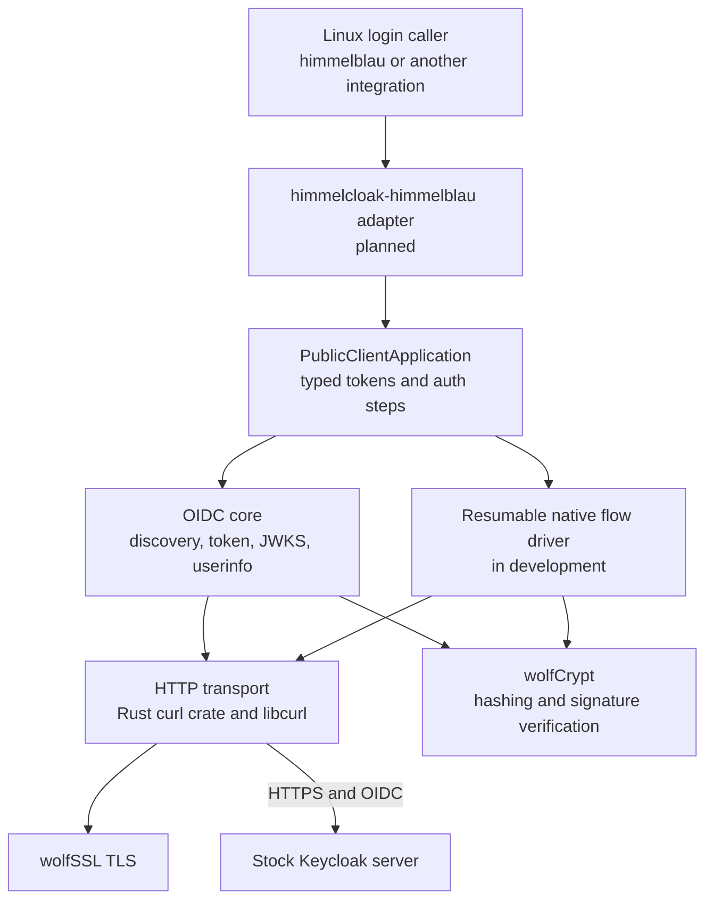

# himmelcloak

himmelcloak is a standalone Rust library for native authentication against
self-hosted Keycloak. It is intended for Linux login integrations, including
himmelblau, and requires no plugin or other code on the Keycloak server.
The library first uses Keycloak's standard OIDC APIs where they cover a login.
A typed, resumable flow driver is the intended path for factors that Keycloak
normally presents through its browser login pages.

The current implementation covers discovery, password direct grant, ID-token
verification, refresh, revocation, and userinfo. The native flow driver,
WebAuthn, recovery codes, and the himmelblau adapter are still in development.
HTTPS uses wolfSSL through libcurl, and cryptographic operations use the
official `wolfssl-wolfcrypt` Rust crate.

## Architecture



The core crate does not depend on himmelblau. The adapter will translate its
typed challenges into the Linux login conversation. See
[Architecture](docs/Architecture.md) for the flow design and extension points.

## Quick start

Docker with Compose v2 provides the reproducible build and a real Keycloak login test:

```sh
git clone https://github.com/aidangarske/himmelcloak.git
cd himmelcloak
make test-live
make oracle-down
```

The test image builds wolfSSL 5.9.2 and wolfSSL-backed libcurl, imports a
disposable realm into stock Keycloak, and runs the Rust client over HTTPS.
On Linux with Rust 1.95 and the native build prerequisites installed:

```sh
make native
make build
make test
```

See [Getting Started](docs/Getting-Started.md) and [Testing](docs/Testing.md)
for prerequisites, configuration, and CI behavior.

## Documentation

The version-controlled pages in [`docs/`](docs/) are the primary documentation:

- [Getting Started](docs/Getting-Started.md)
- [Architecture](docs/Architecture.md)
- [Development Plan](docs/Development-Plan.md)
- [API Reference](docs/API-Reference.md)
- [Testing](docs/Testing.md)
- [Project Structure](docs/Project-Structure.md)
- [Licensing](docs/Licensing.md)

## License

The repository's own source is dual-licensed under LGPL-3.0-or-later OR
GPL-3.0-or-later. The default build links GPL wolfSSL components; see
[Licensing](docs/Licensing.md) for the combined-build terms.
