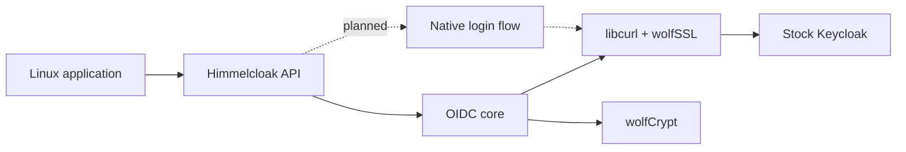

# Architecture

Himmelcloak is a standalone Rust client for stock Keycloak. Applications call
its public API directly; the library owns the Keycloak protocol and token
validation.

## Current baseline

The implemented fast path discovers OIDC metadata and signing keys, performs a
Direct Access Grant with a username, password, and optional TOTP value, and
verifies the returned ID token before exposing it to callers. It also supports
refresh, revocation, and userinfo. TLS peer and hostname verification are
required. The runtime checks that libcurl is using the wolfSSL backend.

The public client accepts a Keycloak base URL, realm, and public client ID.
Direct Access Grants must be enabled for that client. A real Keycloak container
with an imported test realm exercises this path in CI. Direct grant is an
optional Keycloak configuration, so it cannot serve as the only login path.

## Native flow driver

The next core component will initiate Keycloak's authorization-code flow with
PKCE, preserve its session cookies, classify the returned challenge, accept a
typed answer, and exchange the final code for tokens. The caller owns the user
conversation; the library owns protocol state and response validation. The
existing `AuthFlow`, `Challenge`, `Answer`, and `AuthStep` types reserve this
API shape, but `initiate_auth_flow` and `continue_auth_flow` currently return
`NotImplemented`.

For WebAuthn, the intended adapter builds client data for Keycloak's actual
origin and sends the signing request to a caller-provided authenticator. The
flow must preserve WebAuthn origin checks and use an explicit adapter contract
for USB, platform, and virtual test authenticators. Page parsing and theme
compatibility require tests against real Keycloak releases; custom-theme
independence is a design goal, not a current guarantee.

## Planned authentication methods

| Method | Intended mechanism | Current status |
| --- | --- | --- |
| Password | Direct Access Grant; later native flow | Direct grant implemented |
| TOTP | Direct Access Grant; later native flow | Optional direct-grant field implemented; live TOTP fixture pending |
| WebAuthn / passkeys | Native flow and authenticator adapter | Planned |
| SMS / email OTP | Native flow | Planned |
| Recovery codes | Native flow | Planned |
| X.509 / PIV / CAC | Mutual TLS and Keycloak flow | Planned |
| Required actions | Native flow | Planned |
| Device authorization | OIDC device endpoint | Planned |

Feature flags for later methods reserve the additive feature graph. They do
not yet imply that those methods work. The default flags are `password` and
`totp`: disabling `password` disables the direct grant, and disabling `totp`
rejects its OTP parameter. The `gov` and `passwordless` bundles disable the
direct grant even if default features are also selected.

## Crypto and hardware boundaries

The official `wolfssl-wolfcrypt` crate supplies the cryptographic primitives
used by the core. The Rust `curl` crate drives libcurl, built with wolfSSL as
its TLS backend. The native build pins wolfSSL v5.9.2-stable. Future optional
modules can add wolfTPM, wolfHSM, wolfPKCS11, and wolfCOSE without coupling the
baseline OIDC client to those devices.

Request bodies are streamed from zeroizing Rust buffers into libcurl. libcurl
may still hold transient copies of sent bytes, and its HTTP header list copies
bearer tokens into native memory. Rust buffer cleanup cannot erase those native
copies. Treat process memory and core dumps as sensitive while the client is
running.

The source is dual-licensed; the default combined build links GPL wolfSSL
components. See [Licensing](Licensing.md) for the distribution implications.

## Test contract

Every completed method needs a live test against an unmodified Keycloak
container. CI resolves the latest stable release and `nightly` image digests,
then runs the same integration suite against both.
Unit tests cover token validation and transport boundaries without a server.
The live suite will grow to cover authorization-code login, WebAuthn through a
virtual authenticator, recovery, and each new factor as those implementations
land. See [Testing](Testing.md).
